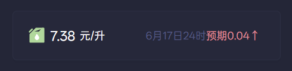
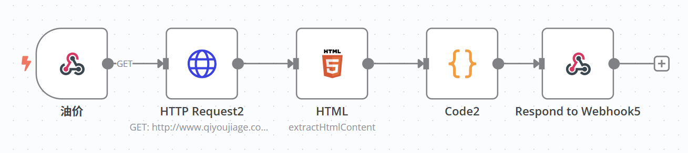

# China Gasoline Prices

> For Chinese users only

show gasoline prices in China



```yaml
- type: custom-api
  title: Gasoline Prices
  cache: 1d
  url: ${N8N_WEBHOOK_ENDPOINT}
  template: |
    {{ $pricePerLiter := .JSON.Float "pricePerLiter" }}
    <div style="display: flex; justify-content: space-between; align-items: center;">
      <div style="display: flex; align-items: center;">
        <svg width="20" height="20" viewBox="0 0 48 48" fill="var(--color-positive)" xmlns="http://www.w3.org/2000/svg"><path d="M42 42V6H39L30 16H12L6 22V42H42Z" fill="var(--color-positive)" stroke="var(--color-positive)" stroke-width="4" stroke-linejoin="round"/><path d="M12 16L22 6H40" stroke="var(--color-positive)" stroke-width="4" stroke-linecap="round" stroke-linejoin="round"/><path d="M20.643 28.8886C22.0743 27.0081 23.1776 24.4103 23.774 23C24.8177 24.4103 27.084 27.9484 27.7997 29.8288C28.6942 32.1793 26.4578 35 23.774 35C21.0903 35 18.8538 31.2391 20.643 28.8886Z" fill="#FFF" stroke="#FFF" stroke-width="4" stroke-linecap="round" stroke-linejoin="round"/><path d="M11 8L4 15" stroke="var(--color-positive)" stroke-width="4" stroke-linecap="round" stroke-linejoin="round"/></svg>
        <span class="color-highlight size-h3" style="margin-right: 5px; margin-left: 5px;">{{ .JSON.Float "price" | formatNumber }}</span>
        <span class="color-highlight size-h5">元/升</span>
      </div>
      <div style="display: flex; align-items: center;">
        <span class="color-subdue size-h5">{{ .JSON.String "adjustmentDate" }}</span>
        <span class="size-h5 {{ if lt $pricePerLiter 0.0 }}color-positive{{ else }}color-negative{{ end }}" style="margin-right: 5px;">预期{{ $pricePerLiter }}{{ if lt $pricePerLiter 0.0 }}↓{{ else }}↑{{ end }}</span>
      </div>
    </div>
```
## Environment variables

- `${N8N_WEBHOOK_ENDPOINT}`

## N8N设置

- 拷贝以下json代码，在n8n画布中粘贴`ctrl+v`即可；
- 修改`http://www.qiyoujiage.com/zhejiang.shtml`以查找不同省份数据；



```json
{
  "nodes": [
    {
      "parameters": {
        "path": "oilprice",
        "responseMode": "responseNode",
        "options": {}
      },
      "type": "n8n-nodes-base.webhook",
      "typeVersion": 2,
      "position": [
        -580,
        360
      ],
      "id": "8b432a62-d160-46fe-9329a-84f131a81974",
      "name": "油价",
      "webhookId": "fc3e37a9-5510-42b9-a5d6-c52dq9j21c25"
    },
    {
      "parameters": {
        "url": "http://www.qiyoujiage.com/zhejiang.shtml",
        "options": {}
      },
      "type": "n8n-nodes-base.httpRequest",
      "typeVersion": 4.2,
      "position": [
        -400,
        360
      ],
      "id": "e19d7633-e15f-4126-9772-652dc1hh1a2e",
      "name": "HTTP Request"
    },
    {
      "parameters": {
        "operation": "extractHtmlContent",
        "extractionValues": {
          "values": [
            {
              "key": "=price",
              "cssSelector": "=#youjia > dl:nth-child(2) > dd",
              "returnValue": "html"
            },
            {
              "key": "tips",
              "cssSelector": "#youjiaCont > div:nth-child(2) "
            }
          ]
        },
        "options": {}
      },
      "type": "n8n-nodes-base.html",
      "typeVersion": 1.2,
      "position": [
        -220,
        360
      ],
      "id": "0b52e926-cfee-4f2b-a573-eba07je09d78",
      "name": "HTML"
    },
    {
      "parameters": {
        "jsCode": "// 获取输入数据\nconst inputData = $input.all()[0].json;\nconst text = inputData.tips;\n\n// 提取关键信息\nconst pricePerTon = text.match(/(\\d+)元\\/吨/)?.[1];      // 提取 320\nconst adjustmentType = text.includes('下调') ? -1 : 1;    // 判断上调(1)或下调(-1)\nconst density = 0.737;                                  // 密度 0.737g/ml\n\n// 单位换算 (1吨 = 1000kg = 1,000,000g → 1,000,000g / 0.737g/ml ≈ 1,356,852ml ≈ 1,356.852升)\nconst pricePerLiter =  adjustmentType * (parseFloat(pricePerTon) / (1000 / 0.737)).toFixed(2);\n\n// 构建结果\nreturn {\n  originalText: text,\n  adjustmentDate: text.match(/(\\d{1,2}月\\d{1,2}日\\d{1,2}时)/)?.[0] || \"无日期\",\n  pricePerTon: pricePerTon ? `${pricePerTon}元/吨` : \"无数据\",\n  adjustmentType: adjustmentType > 0 ? \"上调\" : \"下调\",\n  pricePerLiter: pricePerLiter ? `${pricePerLiter}元/升` : \"无数据\",\n  numericValue: pricePerLiter ? parseFloat(pricePerLiter) : 0,  // 供后续节点使用的数值\n};"
      },
      "type": "n8n-nodes-base.code",
      "typeVersion": 2,
      "position": [
        -40,
        360
      ],
      "id": "3cd05d45-e8bd-4e85-a90c-f730a90fgb51",
      "name": "Code"
    },
    {
      "parameters": {
        "respondWith": "json",
        "responseBody": "={\n  \"price\": {{ $('HTML').item.json.price }},\n  \"adjustmentDate\": \"{{ $json.adjustmentDate }}\",\n  \"pricePerLiter\": {{ $json.numericValue }}\n}",
        "options": {}
      },
      "type": "n8n-nodes-base.respondToWebhook",
      "typeVersion": 1.1,
      "position": [
        120,
        360
      ],
      "id": "9f211a81-a278-40fa-bc91-588e6fs3f22d",
      "name": "Respond to Webhook"
    }
  ],
  "connections": {
    "油价": {
      "main": [
        [
          {
            "node": "HTTP Request",
            "type": "main",
            "index": 0
          }
        ]
      ]
    },
    "HTTP Request": {
      "main": [
        [
          {
            "node": "HTML",
            "type": "main",
            "index": 0
          }
        ]
      ]
    },
    "HTML": {
      "main": [
        [
          {
            "node": "Code",
            "type": "main",
            "index": 0
          }
        ]
      ]
    },
    "Code": {
      "main": [
        [
          {
            "node": "Respond to Webhook",
            "type": "main",
            "index": 0
          }
        ]
      ]
    }
  },
  "pinData": {}
}
```

