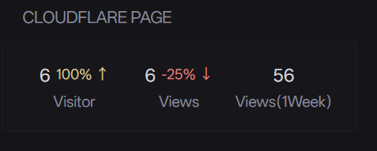

# Cloudflare Stats

show cloudflare Stats



```yaml
- type: custom-api
  title: Cloudflare Page
  cache: 1h
  bodyType: json
  template: |
    <!-- 0h to -24h -->
    {{$payload_0to24h := printf `{"operationName":"GetRumAnalyticsTopNs","variables":{"accountTag":"${ACCOUNT_TAG}","filter":{"AND":[{"datetime_geq":"%s","datetime_leq":"%s"},{"OR":[{"siteTag":"${SITE_TAG}"}]}]},"order":"sum_visits_DESC"},"query":"query GetRumAnalyticsTopNs { viewer { accounts(filter: {accountTag: $accountTag}) { total: rumPageloadEventsAdaptiveGroups(filter: $filter, limit: 1) { count sum { visits __typename } __typename } __typename } __typename }}"}` (offsetNow "-24h" | formatTime "RFC3339") (now | formatTime "RFC3339")}}
    {{
      $events_0to24h := newRequest "https://api.cloudflare.com/client/v4/graphql"
        | withStringBody $payload_0to24h
        | withHeader "Authorization" "Bearer ${API_TOKEN}"
        | getResponse
    }}
    {{ $count_0to24h := $events_0to24h.JSON.Int "data.viewer.accounts.0.total.0.count" }}
    {{ $visits_0to24h := $events_0to24h.JSON.Int "data.viewer.accounts.0.total.0.sum.visits" }}

    <!-- -24h to -48h -->
    {{$payload_24to48h := printf `{"operationName":"GetRumAnalyticsTopNs","variables":{"accountTag":"${ACCOUNT_TAG}","filter":{"AND":[{"datetime_geq":"%s","datetime_leq":"%s"},{"OR":[{"siteTag":"${SITE_TAG}"}]}]},"order":"sum_visits_DESC"},"query":"query GetRumAnalyticsTopNs { viewer { accounts(filter: {accountTag: $accountTag}) { total: rumPageloadEventsAdaptiveGroups(filter: $filter, limit: 1) { count sum { visits __typename } __typename } __typename } __typename }}"}` (offsetNow "-48h" | formatTime "RFC3339") (offsetNow "-24h" | formatTime "RFC3339")}}
    {{
      $events_24to48h := newRequest "https://api.cloudflare.com/client/v4/graphql"
        | withStringBody $payload_24to48h
        | withHeader "Authorization" "Bearer ${API_TOKEN}"
        | getResponse
    }}
    {{ $count_24to48h := $events_24to48h.JSON.Int "data.viewer.accounts.0.total.0.count" }}
    {{ $visits_24to48h := $events_24to48h.JSON.Int "data.viewer.accounts.0.total.0.sum.visits" }}

    <!-- 0h to -7d -->
    {{$payload_0to7d := printf `{"operationName":"GetRumAnalyticsTopNs","variables":{"accountTag":"${ACCOUNT_TAG}","filter":{"AND":[{"datetime_geq":"%s","datetime_leq":"%s"},{"OR":[{"siteTag":"${SITE_TAG}"}]}]},"order":"sum_visits_DESC"},"query":"query GetRumAnalyticsTopNs { viewer { accounts(filter: {accountTag: $accountTag}) { total: rumPageloadEventsAdaptiveGroups(filter: $filter, limit: 1) { count sum { visits __typename } __typename } __typename } __typename }}"}` (offsetNow "-144h" | formatTime "RFC3339") (now | formatTime "RFC3339")}}
    {{
      $events_0to7d := newRequest "https://api.cloudflare.com/client/v4/graphql"
        | withStringBody $payload_0to7d
        | withHeader "Authorization" "Bearer ${API_TOKEN}"
        | getResponse
    }}
    {{ $count_0to7d := $events_0to7d.JSON.Int "data.viewer.accounts.0.total.0.count" }}
    {{ $visits_0to7d := $events_0to7d.JSON.Int "data.viewer.accounts.0.total.0.sum.visits" }}

    {{ $count_diff := mul (div ((sub $count_0to24h $count_24to48h) | toFloat) ($count_24to48h | toFloat)) 100 | toInt }}
    {{ $visits_diff := mul (div ((sub $visits_0to24h $visits_24to48h) | toFloat) ($visits_24to48h | toFloat)) 100 | toInt }}

    <div style="display: flex; justify-content: space-between;">
      <div style="flex: 1; text-align: center;">
        <div style="display: flex; justify-content: center; align-items: center;">
          <p class="color-highlight size-h3" style="margin-right: 5px;">{{ $visits_0to24h }}</p>
          <p class="size-h5 {{ if gt $visits_0to24h $visits_24to48h }}color-positive{{ else }}color-negative{{ end }}">
            {{ $visits_diff }}%
            {{ if gt $visits_0to24h $visits_24to48h }}↑{{ else }}↓{{ end }}
          </p>
        </div>
        <p>Visitor</p>
      </div>

      <div style="flex: 1; text-align: center;">
        <div style="display: flex; justify-content: center; align-items: center;">
          <p class="color-highlight size-h3" style="margin-right: 5px;">{{ $count_0to24h }}  </p>
          <p class="size-h5 {{ if gt $count_0to24h $count_24to48h }}color-positive{{ else }}color-negative{{ end }}">
            {{ $count_diff }}%
            {{ if gt $count_0to24h $count_24to48h }}↑{{ else }}↓{{ end }}
          </p>
        </div>
        <p>Views</p>
      </div>

      <div style="flex: 1; text-align: center;">
        <div style="display: flex; justify-content: center; align-items: center;">
          <p class="color-highlight size-h3">{{ $count_0to7d }}</p>
        </div>
        <p>Views(1Week)</p>
      </div>
    </div>
```
## Environment variables

- `${API_TOKEN}` - `API Tokens`
- `${ACCOUNT_TAG}` - `accountTag`
- `${SITE_TAG}` - `siteTag`

Find your `API Tokens`, `accountTag` and `siteTag`- [Create API token](https://developers.cloudflare.com/fundamentals/api/get-started/create-token/)

Your can capture graphqL queries with chrome devtools - [capture-graphql-queries-from-dashboard](https://developers.cloudflare.com/analytics/graphql-api/tutorials/capture-graphql-queries-from-dashboard/)

