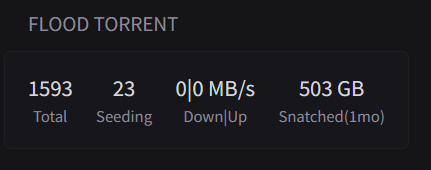

# Flood Stats

show stats from Flood torrent client



```yaml
- type: custom-api
  title: Flood Torrent
  cache: 5m
  url: ${FLOOD_STATS_ENDPOINT}
  headers:
    Accept: application/json
  template: |
    <div class="flex justify-between text-center">
      <div>
          <div class="color-highlight size-h3">{{ .JSON.Float "total" }}</div>
          <div class="size-h6">Total</div>
      </div>
      <div>
          <div class="color-highlight size-h3">{{ .JSON.Int "seeding" }}</div>
          <div class="size-h6">Seeding</div>
      </div>
      <div>
          <div class="color-highlight size-h3">{{ div (.JSON.Float "total_download_rate") 1048576 | toInt | formatNumber }}|{{ div (.JSON.Float "total_upload_rate") 1048576 | toInt | formatNumber }} MB/s</div>
          <div class="size-h6">Down|Up</div>
      </div>
      <div>
          <div class="color-highlight size-h3">{{ div (.JSON.Float "recent_down_total") 1073741824 | toInt | formatNumber }} GB</div>
          <div class="size-h6">Snatched(1mo)</div>
      </div>
    </div>
```
## Environment variables

- `${FLOOD_STATS_ENDPOINT}` - #TODO.

