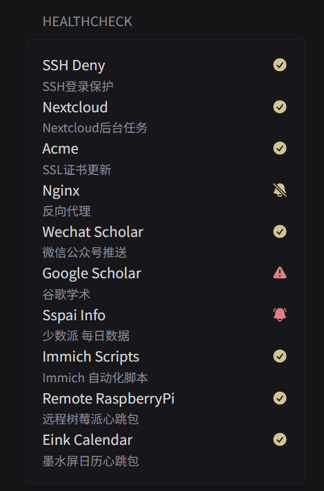

# Healthchecks Stats

show stats from Healthchecks, including four stats:`up`,`down`,`paused`,`grace`



```yaml
- type: custom-api
  title: HealthChecks
  cache: 5m
  url: ${HEALTHCHECK_SERVER}/api/v1/checks/
  headers:
    x-api-key: ${HEALTHCHECK_TOKEN}
    Accept: application/json
  template: |
    {{ range $i, $v := .JSON.Array "checks" }}
      {{ $name := $v.String "name" }}
      {{ $status := $v.String "status" }}
      {{ $desc := $v.String "desc" }}

      <li class="flex items-center color-highlight size-h3">
        <span class="grow min-width-0"> {{$name}} </span>
        <span class="shrink-0 text-right">
          {{ if eq $status "up" }} 
            <div class="monitor-site-status-icon-compact" title="{{ $status }}">
              <svg fill="var(--color-positive)" xmlns="http://www.w3.org/2000/svg" viewBox="0 0 20 20">
                  <path fill-rule="evenodd" d="M10 18a8 8 0 1 0 0-16 8 8 0 0 0 0 16Zm3.857-9.809a.75.75 0 0 0-1.214-.882l-3.483 4.79-1.88-1.88a.75.75 0 1 0-1.06 1.061l2.5 2.5a.75.75 0 0 0 1.137-.089l4-5.5Z" clip-rule="evenodd" />
              </svg>
            </div>
          {{ else if eq $status "down"}}
            <div class="monitor-site-status-icon-compact" title="{{ $status }}">
              <svg fill="var(--color-negative)" xmlns="http://www.w3.org/2000/svg" viewBox="0 0 20 20">
                  <path fill-rule="evenodd" d="M8.485 2.495c.673-1.167 2.357-1.167 3.03 0l6.28 10.875c.673 1.167-.17 2.625-1.516 2.625H3.72c-1.347 0-2.189-1.458-1.515-2.625L8.485 2.495ZM10 5a.75.75 0 0 1 .75.75v3.5a.75.75 0 0 1-1.5 0v-3.5A.75.75 0 0 1 10 5Zm0 9a1 1 0 1 0 0-2 1 1 0 0 0 0 2Z" clip-rule="evenodd" />
              </svg>
            </div>
          {{ else if eq $status "paused"}}
            <div class="monitor-site-status-icon-compact" title="{{ $status }}">
              <svg fill="var(--color-positive)" xmlns="http://www.w3.org/2000/svg" viewBox="0 0 24 24" fill="currentColor" class="size-6">
                <path d="M3.53 2.47a.75.75 0 0 0-1.06 1.06l18 18a.75.75 0 1 0 1.06-1.06l-18-18ZM20.57 16.476c-.223.082-.448.161-.674.238L7.319 4.137A6.75 6.75 0 0 1 18.75 9v.75c0 2.123.8 4.057 2.118 5.52a.75.75 0 0 1-.297 1.206Z" />
                <path fill-rule="evenodd" d="M5.25 9c0-.184.007-.366.022-.546l10.384 10.384a3.751 3.751 0 0 1-7.396-1.119 24.585 24.585 0 0 1-4.831-1.244.75.75 0 0 1-.298-1.205A8.217 8.217 0 0 0 5.25 9.75V9Zm4.502 8.9a2.25 2.25 0 1 0 4.496 0 25.057 25.057 0 0 1-4.496 0Z" clip-rule="evenodd" />
              </svg>
          {{ else if eq $status "grace"}}
            <div class="monitor-site-status-icon-compact" title="{{ $status }}">
              <svg fill="var(--color-negative)" xmlns="http://www.w3.org/2000/svg" viewBox="0 0 24 24" fill="currentColor" class="size-6">
                <path d="M5.85 3.5a.75.75 0 0 0-1.117-1 9.719 9.719 0 0 0-2.348 4.876.75.75 0 0 0 1.479.248A8.219 8.219 0 0 1 5.85 3.5ZM19.267 2.5a.75.75 0 1 0-1.118 1 8.22 8.22 0 0 1 1.987 4.124.75.75 0 0 0 1.48-.248A9.72 9.72 0 0 0 19.266 2.5Z" />
                <path fill-rule="evenodd" d="M12 2.25A6.75 6.75 0 0 0 5.25 9v.75a8.217 8.217 0 0 1-2.119 5.52.75.75 0 0 0 .298 1.206c1.544.57 3.16.99 4.831 1.243a3.75 3.75 0 1 0 7.48 0 24.583 24.583 0 0 0 4.83-1.244.75.75 0 0 0 .298-1.205 8.217 8.217 0 0 1-2.118-5.52V9A6.75 6.75 0 0 0 12 2.25ZM9.75 18c0-.034 0-.067.002-.1a25.05 25.05 0 0 0 4.496 0l.002.1a2.25 2.25 0 1 1-4.5 0Z" clip-rule="evenodd" />
              </svg>
            </div>
          {{ end }}
        </span>
      </li>
      <li class="flex items-center">
        {{$desc}}
      </li>
    {{ end }}
```

## Environment variables

- `${HEALTHCHECK_SERVER}` - like `http://192.168.1.1:8000`.
- `${HEALTHCHECK_TOKEN}` - Dashboard of Healthchecks-`settings`-`API Access`-`API key`
