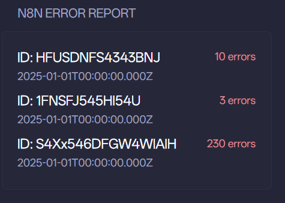
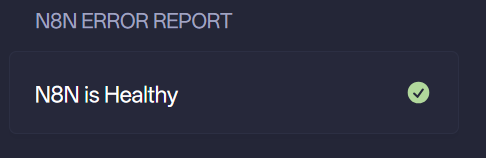

# N8N ERROR REPORT





```yaml
- type: custom-api
  title: n8n error report
  cache: 1h
  url: ${N8N_ERROR_REPORT_ENDPOINT}
  options:
    base_url: ${N8N_BASE_URL}
  template: |
    {{ $base_url := .Options.StringOr "base_url" "not defined"}}
    {{ $errorsNum := .JSON.Int "errorsNum" }}  
    {{ if eq $errorsNum 0 }}
      <li class="flex items-center color-highlight size-h3">
        <span class="grow min-width-0">N8N is Healthy</span>
        <span class="shrink-0 text-right">
          <div class="monitor-site-status-icon-compact">
            <svg fill="var(--color-positive)" xmlns="http://www.w3.org/2000/svg" viewBox="0 0 20 20">
                <path fill-rule="evenodd" d="M10 18a8 8 0 1 0 0-16 8 8 0 0 0 0 16Zm3.857-9.809a.75.75 0 0 0-1.214-.882l-3.483 4.79-1.88-1.88a.75.75 0 1 0-1.06 1.061l2.5 2.5a.75.75 0 0 0 1.137-.089l4-5.5Z" clip-rule="evenodd" />
            </svg>
          </div>
        </span>
      </li>
    {{ else }}
      {{ $errors := .JSON.Array "errors" }}
      {{ range $errors }}
        {{ $workflowId := .String "workflowId" }}
        {{ $latestId := .String "latestId" }}
        <li class="flex items-center color-highlight size-h3 ">
          <a href="{{ concat $base_url "/workflow/" $workflowId "/executions/" $latestId }}"
            class="grow min-w-0 text-ellipsis whitespace-nowrap overflow-hidden">
            ID: {{ $workflowId }}
          </a>
          <span class="shrink-0 text-right color-negative size-h5">{{ .Int "errorCount" }} errors</span>
        </li>
        <li class="flex items-center size-h5" style="margin-bottom: 5px;">
          {{ .String "latestRunTime"}}
        </li>
      {{ end }}
    {{ end }}
```
## Environment variables

- `${N8N_ERROR_REPORT_ENDPOINT}` - like `http://192.168.1.1:5678/webhook/xxxxxx`.
- `${N8N_BASE_URL}` like `http://192.168.1.1:5678`

## N8N workflow

- Create n8n api key in `Settings`-`n8n API`;
- Set credentials in `Overview`-`Credentials`-`Create`-`Credential`-`n8n API`;
- Workflow Editor: `Webhook`->`n8n`->`Code`->`Respond to Webhook`;
- Settings in node `Webhook`: `Respond`: `Using 'Respond to Webhook'Node`
- Settings in node `n8n`:

```JSON
"parameters": {
  "resource": "execution",
  "limit": 250,
  "filters": {
    "status": "error"
  },
  "options": {},
  "requestOptions": {}
},
```

- Settings in node `Code`:

```javascript
const now = new Date();
const past24Hours = new Date(now.getTime() -  24 * 60 * 60 * 1000);
const inputData = items.map(item => item.json);
const recentLogs = inputData.filter(log => {
  const startedAt = new Date(log.startedAt);
  return startedAt >= past24Hours && log.mode !== 'manual';
});
const workflowStats = {};

for (const log of recentLogs) {
  const { workflowId, finished, startedAt, id } = log;
  if (!workflowStats[workflowId]) {
    workflowStats[workflowId] = {
      errorCount: 0,
      latestRun: new Date(0),
      latestId: null,
    };
  }
  if (!finished) {
    workflowStats[workflowId].errorCount += 1;
  }
  const runTime = new Date(startedAt);
  if (runTime > workflowStats[workflowId].latestRun) {
    workflowStats[workflowId].latestRun = runTime;
    workflowStats[workflowId].latestId = id;
  }
}

const errors = Object.entries(workflowStats)
  .filter(([_, stats]) => stats.errorCount > 0)
  .map(([workflowId, stats]) => ({
    workflowId,
    errorCount: stats.errorCount,
    latestRunTime: stats.latestRun.toISOString(),
    latestId: stats.latestId,
  }));

return {
    errorsNum: errors.length,
    errors: errors
  };
```

- Settings in node `Respond to Webhook`: `Respond With`: `First Incoming Item`


