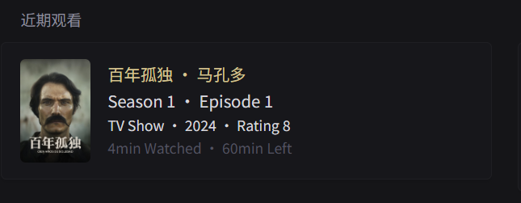

# Recent Plex

show recent activities(TV or Movie) from Plex



```yaml
- type: custom-api
  title: Recent Plex
  cache: 4h
  url: ${PLEX_SERVER}/library/onDeck
  headers:
    X-Plex-Token: ${PLEX_TOKEN}
    Accept: application/json
  template: |
    <div>
      {{ $librarySectionID := .JSON.Int "MediaContainer.Metadata.0.librarySectionID" }}
      {{ if eq $librarySectionID 1 }}
        {{ $viewOffset := .JSON.Float "MediaContainer.Metadata.0.viewOffset" }}
        {{ $duration := .JSON.Float "MediaContainer.Metadata.0.duration" }}
        {{ $thumbPath := .JSON.String "MediaContainer.Metadata.0.grandparentThumb"}}
        {{ $thumbURL := concat "${PLEX_SERVER}" $thumbPath "?X-Plex-Token=${PLEX_TOKEN}" }}
        <li style="display: flex; align-items: center; gap: 6px;>">
          
          <div>
            <span class="size-h3 color-primary">{{ .JSON.String "MediaContainer.Metadata.0.grandparentTitle" }} · {{ .JSON.String "MediaContainer.Metadata.0.title" }}</span><br>
            <span class="size-h3 color-highlight">{{ .JSON.String "MediaContainer.Metadata.0.parentTitle" }} · Episode {{ .JSON.String "MediaContainer.Metadata.0.index" }}</span><br>
            <span class="size-base color-highlight">TV Show</span>
            <span class="size-base color-highlight"> · {{ .JSON.Int "MediaContainer.Metadata.0.year" }} · Rating {{ .JSON.Float "MediaContainer.Metadata.0.audienceRating" }}</span><br>
            <span class="size-base color-subdue">{{ div $viewOffset 60000 | toInt |formatNumber }}min Watched · {{ div (sub $duration $viewOffset) 60000 | toInt |formatNumber }}min Left</span>
          </div>
        </li>
      {{ else if eq $librarySectionID 2 }}
        {{ $duration := .JSON.Float "MediaContainer.Metadata.0.duration" }}
        {{ $thumbPath := .JSON.String "MediaContainer.Metadata.0.thumb"}}
        {{ $thumbURL := concat "${PLEX_SERVER}" $thumbPath "?X-Plex-Token=${PLEX_TOKEN}" }}
        <li style="display: flex; align-items: center;">
          
          <div>
            <span class="size-h3 color-primary">{{ .JSON.String "MediaContainer.Metadata.0.title" }}</span><br>
            <span class="size-h3 color-highlight">{{ .JSON.String "MediaContainer.Metadata.0.Country.0.tag" }} · {{ .JSON.String "MediaContainer.Metadata.0.Director.0.tag" }} · {{ .JSON.String "MediaContainer.Metadata.0.Genre.0.tag" }}</span><br>
            <span class="size-base color-primary">Movie</span>
            <span class="size-base color-highlight"> · {{ .JSON.Int "MediaContainer.Metadata.0.year" }} · Rating {{ .JSON.Float "MediaContainer.Metadata.0.audienceRating" }}</span><br>
            <span class="size-base color-subdue">Total {{ div $duration 60000 | toInt |formatNumber }}min · {{ .JSON.Int "MediaContainer.Metadata.0.Media.0.videoCodec" }} {{ .JSON.Int "MediaContainer.Metadata.0.Media.0.videoResolution" }}</span>
          </div>
        </li>
      {{ end }}
    </div>
```

## Environment variables

- `${PLEX_SERVER}` - like `http://192.168.1.1:32400`.
- `${PLEX_TOKEN}` - follow the steps to get plex token - [finding-an-authentication-token-x-plex-token](https://support.plex.tv/articles/204059436-finding-an-authentication-token-x-plex-token/)
-  Specify the `librarySectionID` according to your own library.