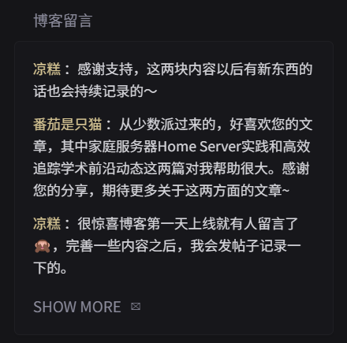

# Recent Twikoo Comments

show latest comments from Twikoo



```yaml
- type: custom-api
  title: Twikoo
  cache: 6h
  url: ${TWIKOO_ENVID}
  headers:
    authority: ${TWIKOO_ENVID}
    content-type: application/json
    Accept: application/json
  method: POST
  bodyType: json
  body: {"event":"COMMENT_GET_FOR_ADMIN","accessToken":"${TWIKOO_TOKEN}","per":5,"page":1,"keyword":"","type":""}
  template: |
      <ul class="list list-gap-10 collapsible-container" data-collapse-after="3">
      {{ range $i, $v := .JSON.Array "data" }}
        <li>
          {{ $nick := $v.String "nick" }}
          {{ $comment := $v.String "comment" }}
          {{ $updated := $v.Int "updated" }}
          {{ $seconds := div $updated 1000 }}
          <div>
            <span class="size-base color-positive">{{ $nick }}</span>
            <span class="size-base color-highlight">：{{findSubmatch "<p>(.*?)</p>" $comment}}</span>
          </div>
        </li>
      {{ end }}
      </ul>
```

## Environment variables

- `${TWIKOO_ENVID}` - like `https://comments.osnsyc.top`.
- `${TWIKOO_TOKEN}` - login twikoo account through browser-press`F12`or`CTRL+SHIFT+C`or`Command+SHIFT+C`-`Network`-`Fetch/XHR`-reload login twikoo-click`${TWIKOO_ENVID}`-`paylod`-`accessToken`
