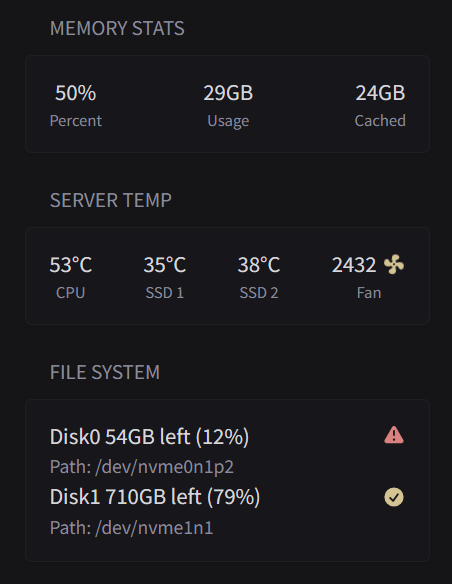

# Server Stats from Glances

show server stats from glances, check api for more info



```yaml
- type: custom-api
  title: Server temp
  cache: 1m
  url: ${GLANCES_SERVER}/api/4/sensors
  headers:
    Accept: application/json
  template: |
    <div class="flex justify-between text-center">
      {{ range $i, $v := .JSON.Array ""}}
        {{ $value := $v.Float "value" }}
        {{ if eq $i 4 }}
          <div>
            <div class="{{ if gt $value 55.0 }}color-negative{{ else }}color-highlight{{ end }} size-h3">{{ $value }}°C</div>
            <div class="size-h6">CPU</div>
          </div>
        {{ else if eq $i 21 }}
          <div>
            <div style="display: flex; align-items: center; gap: 4px;">
              <div class="color-highlight size-h3">{{ $value }}</div>
              <div class="monitor-site-status-icon-compact" title="1">
                <svg class="spin-icon" fill="var(--color-positive)" xmlns="http://www.w3.org/2000/svg" viewBox="0 0 20 20">
                    <path style=" stroke:none;" d="M 10 9.167969 C 9.539062 9.167969 9.167969 9.539062 9.167969 10 C 9.167969 10.460938 9.539062 10.832031 10 10.832031 C 10.460938 10.832031 10.832031 10.460938 10.832031 10 C 10.832031 9.539062 10.460938 9.167969 10 9.167969 M 10.417969 1.667969 C 14.167969 1.667969 14.25 4.640625 12.273438 5.625 C 11.53125 6.066406 11.03125 6.824219 10.925781 7.683594 C 11.324219 7.847656 11.675781 8.109375 11.949219 8.441406 C 15 6.773438 18.332031 7.433594 18.332031 10.417969 C 18.332031 14.167969 15.351562 14.25 14.375 12.273438 C 13.921875 11.53125 13.15625 11.035156 12.292969 10.925781 C 12.125 11.324219 11.863281 11.671875 11.535156 11.949219 C 13.199219 15.023438 12.535156 18.332031 9.550781 18.332031 C 5.832031 18.332031 5.742188 15.351562 7.714844 14.367188 C 8.449219 13.921875 8.941406 13.171875 9.066406 12.324219 C 8.660156 12.164062 8.300781 11.902344 8.023438 11.558594 C 4.949219 13.207031 1.667969 12.558594 1.667969 9.582031 C 1.667969 5.832031 4.617188 5.742188 5.601562 7.714844 C 6.046875 8.457031 6.808594 8.949219 7.667969 9.058594 C 7.828125 8.65625 8.089844 8.304688 8.433594 8.042969 C 6.773438 5 7.433594 1.667969 10.398438 1.667969 Z M 10.417969 1.667969 "/>
                </svg>
              </div>
            </div>
            <div class="size-h6">Fan</div>
          </div>
        {{ else if eq $i 5 }}
          <div>
            <div class="{{ if gt $value 50.0 }}color-negative{{ else }}color-highlight{{ end }} size-h3">{{ $value }}°C</div>
            <div class="size-h6">SSD 1</div>
          </div>
        {{ else if eq $i 6 }}
          <div>
            <div class="{{ if gt $value 50.0 }}color-negative{{ else }}color-highlight{{ end }} size-h3">{{ $value }}°C</div>
            <div class="size-h6">SSD 2</div>
          </div>
        {{ end }}
      {{ end }}
    </div>
```

`custom-style.css`
```css
.spin-icon {
    animation: spin 2s linear infinite;
    transform-origin: center;
  }
  @keyframes spin {
    from { transform: rotate(0deg); }
    to { transform: rotate(360deg); }
  }
```

```yaml
- type: custom-api
  title: file system
  cache: 1d
  url: ${GLANCES_SERVER}/api/4/fs
  headers:
    Accept: application/json
  template: |
    {{ range $i, $v := .JSON.Array "" }}
      {{ $device_name := $v.String "device_name" }}
      {{ $free := $v.Int "free" }}
      {{ $percent := $v.Float "percent" }}

      <li class="flex items-center color-highlight size-h3">
        <span class="grow min-width-0"> Disk{{$i}} {{ div $free 1073741824 | formatNumber }}GB left ({{sub 100.0 $percent | toInt }}%) </span>
        <span class="shrink-0 text-right">
          {{ if lt $percent 85.0 }} 
            <div class="monitor-site-status-icon-compact" title="{{ $percent }}">
                <svg fill="var(--color-positive)" xmlns="http://www.w3.org/2000/svg" viewBox="0 0 20 20">
                    <path fill-rule="evenodd" d="M10 18a8 8 0 1 0 0-16 8 8 0 0 0 0 16Zm3.857-9.809a.75.75 0 0 0-1.214-.882l-3.483 4.79-1.88-1.88a.75.75 0 1 0-1.06 1.061l2.5 2.5a.75.75 0 0 0 1.137-.089l4-5.5Z" clip-rule="evenodd" />
                </svg>
            </div>
          {{ else }}
            <div class="monitor-site-status-icon-compact" title="{{ $percent }}">
                <svg fill="var(--color-negative)" xmlns="http://www.w3.org/2000/svg" viewBox="0 0 20 20">
                    <path fill-rule="evenodd" d="M8.485 2.495c.673-1.167 2.357-1.167 3.03 0l6.28 10.875c.673 1.167-.17 2.625-1.516 2.625H3.72c-1.347 0-2.189-1.458-1.515-2.625L8.485 2.495ZM10 5a.75.75 0 0 1 .75.75v3.5a.75.75 0 0 1-1.5 0v-3.5A.75.75 0 0 1 10 5Zm0 9a1 1 0 1 0 0-2 1 1 0 0 0 0 2Z" clip-rule="evenodd" />
                </svg>
            </div>
          {{ end }}
        </span>
      </li>
      <li class="flex items-center">
        Path: {{$device_name}}
      </li>
    {{ end }}
```

```yaml
- type: custom-api
  title: Memory stats
  cache: 1m
  url: ${GLANCES_SERVER}/api/4/mem
  headers:
    Accept: application/json
  template: |
    <div class="flex justify-between text-center">
      <div>
          <div class="color-highlight size-h3">{{ .JSON.Int "percent" | formatNumber }}%</div>
          <div class="size-h6">Percent</div>
      </div>
      <div>
          <div class="color-highlight size-h3">{{ div (.JSON.Int "used" | toFloat) 1073741824 | toInt | formatNumber }}GB</div>
          <div class="size-h6">Usage</div>
      </div>
      <div>
          <div class="color-highlight size-h3">{{ div (.JSON.Int "cached" | toFloat) 1073741824 | toInt | formatNumber }}GB</div>
          <div class="size-h6">Cached</div>
      </div>
    </div>
```
## Environment variables

- `${GLANCES_SERVER}` - like `http://192.168.1.1:61208`.

## More endpoint

- [glances-api](https://glances.readthedocs.io/en/latest/api.html)
