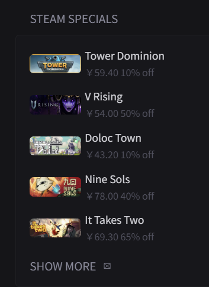

# Steam Specials

show a list of discounted games on Steam, source: [steam-specials-by-svilenmarkov](https://github.com/glanceapp/community-widgets/blob/main/widgets/steam-specials-by-svilenmarkov)



```yaml
- type: custom-api
  title: Steam Specials
  cache: 12h
  url: https://store.steampowered.com/api/featuredcategories?cc=cn
  template: |
    <ul class="list list-gap-10 collapsible-container" data-collapse-after="5">
      {{ range .JSON.Array "specials.items" }}
        {{ $discount := .Int "discount_percent" }}
        <li>
          <div style=" display: flex;align-items: center;">
            
            <div>
              <span class="size-base color-highlight">{{ .String "name" }}</span><br>
              <span class="size-h5 color-subdue">
                {{ .Int "final_price" | toFloat | mul 0.01 | printf "￥%.2f" }}
                {{ $discount }}% off
              </span>
            </div>
          </div>
        </li>
      {{ end }}
    </ul>
```

## Changing currency

You can change the currency by changing the `cc` parameter in the URL to your country's [2 character code](https://en.wikipedia.org/wiki/ISO_3166-1_alpha-2). For example, to get the prices in euros, you can change the URL to `https://store.steampowered.com/api/featuredcategories?cc=eu` and then change the `$` symbol to `€` in the template.