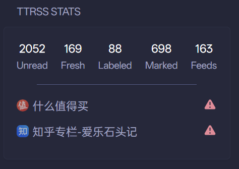

# Tiny Tiny RSS Stats

Show stats from Tiny Tiny RSS, supporting labels: `Unread`, `Fresh`, `Labeled`, `Marked` and `Feeds`.
Show unhealthy feeds and error info.



```yaml
- type: custom-api
  title: TTRSS Stats
  cache: 1h
  options:
    sid: ${sid}
    url: ${url}
  template: |
    {{ $sid := .Options.StringOr "sid" "not defined"}}
    {{ $url := .Options.StringOr "url" "not defined"}}

    {{$payload := printf `{"sid":"%s","op":"getCounters","output_mode":"l"}` $sid}}
    {{
      $response := newRequest (concat $url "/api/")
        | withStringBody $payload
        | getResponse
    }}
    {{ $feeds := $response.JSON.Array "content" }}
    {{ $globalUnreadCounter := 0 }}
    {{ $feedsCounter := 0 }}
    {{ $markedcounter := 0 }}
    {{ $labeledUnreadCounter := 0 }}
    {{ $freshCounter := 0 }}

    {{ range $feeds }}
      {{ if eq (.String "id") "global-unread" }}
        {{ $globalUnreadCounter = (.Int "counter") }}
      {{ else if eq (.String "id") "subscribed-feeds" }}
        {{ $feedsCounter = (.Int "counter") }}
      {{ else if eq (.String "id") "-1" }}
        {{ $markedcounter = (.Int "markedcounter") }}
      {{ else if and (eq (.String "kind") "cat") (eq (.String "id") "-2") }}
        {{ $labeledUnreadCounter = (.Int "counter") }}
      {{ else if eq (.String "id") "-3" }}
        {{ $freshCounter = (.Int "counter") }}
      {{ end }}
    {{ end }}

    <div class="flex justify-between text-center">
      <div>
        <a href="{{ concat $url "/#f=-4&c=0" }}">
          <div class="color-highlight size-h3">{{ $globalUnreadCounter }}</div>
          <div>Unread</div>
        </a>
      </div>
      <div>
        <a href="{{ concat $url "/#f=-3&c=0" }}">
          <div class="color-highlight size-h3">{{ $freshCounter }}</div>
          <div>Fresh</div>
        </a>
      </div>
      <div>
        <a href="{{ concat $url "/#f=-2&c=1" }}">
          <div class="color-highlight size-h3">{{ $labeledUnreadCounter }}</div>
          <div>Labeled</div>
        </a>
      </div>
      <div>
        <a href="{{ concat $url "/#f=-1&c=0" }}">
          <div class="color-highlight size-h3">{{ $markedcounter }}</div>
          <div>Marked</div>
        </a>
      </div>
      <div>
        <div class="color-highlight size-h3">{{ $feedsCounter }}</div>
        <div>Feeds</div>
      </div>
    </div>

    <div style="width: 80%; height: 1px; background-color: var(--color-text-subdue); margin: 15px auto 15px;"></div>

    <ul class="list list-gap-10 collapsible-container">
    {{ $hasError := false }}
    {{ range $feed := $feeds }}
      {{ if ne (.String "error") ""}}
        {{ $hasError = true }}
        <li>
          <div style="display: flex; justify-content: space-between; align-items: center;">
            <div style="display: flex; align-items: center;">
              
              <span class="size-h3" style="margin-right: 5px; margin-left: 5px;">{{ .String "title" }}</span>
            </div>
            <div class="monitor-site-status-icon-compact" title="{{ .String "error" | findMatch "^[^:]*" }}">
              <svg fill="var(--color-negative)" xmlns="http://www.w3.org/2000/svg" viewBox="0 0 20 20">
                <path fill-rule="evenodd" d="M8.485 2.495c.673-1.167 2.357-1.167 3.03 0l6.28 10.875c.673 1.167-.17 2.625-1.516 2.625H3.72c-1.347 0-2.189-1.458-1.515-2.625L8.485 2.495ZM10 5a.75.75 0 0 1 .75.75v3.5a.75.75 0 0 1-1.5 0v-3.5A.75.75 0 0 1 10 5Zm0 9a1 1 0 1 0 0-2 1 1 0 0 0 0 2Z" clip-rule="evenodd" />
              </svg>
            </div>
          </div>
        </li>
      {{ end }}
    {{ end }}
    {{ if not $hasError }}
      <li class="flex items-center color-primary size-h3">
        <span class="grow min-width-0">All feeds are healthy.</span>
        <span class="shrink-0 text-right">
          <div class="monitor-site-status-icon-compact">
            <svg fill="var(--color-positive)" xmlns="http://www.w3.org/2000/svg" viewBox="0 0 20 20">
                <path fill-rule="evenodd" d="M10 18a8 8 0 1 0 0-16 8 8 0 0 0 0 16Zm3.857-9.809a.75.75 0 0 0-1.214-.882l-3.483 4.79-1.88-1.88a.75.75 0 1 0-1.06 1.061l2.5 2.5a.75.75 0 0 0 1.137-.089l4-5.5Z" clip-rule="evenodd" />
            </svg>
          </div>
        </span>
      </li>
    {{ end }}
    <ul>
```

## Environment variables

- `${url}` - TTRSS site like `http://example.com`
- `${sid}` - get through `curl -d '{"op":"login","user":"you","password":"xxx"}' http://example.com/api/"`.
